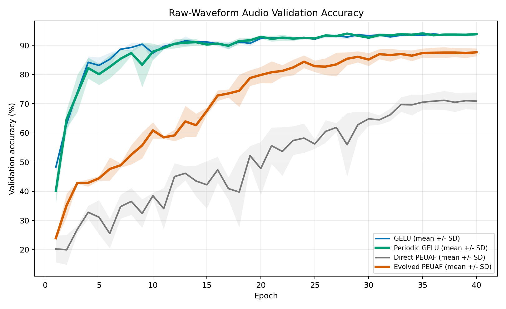
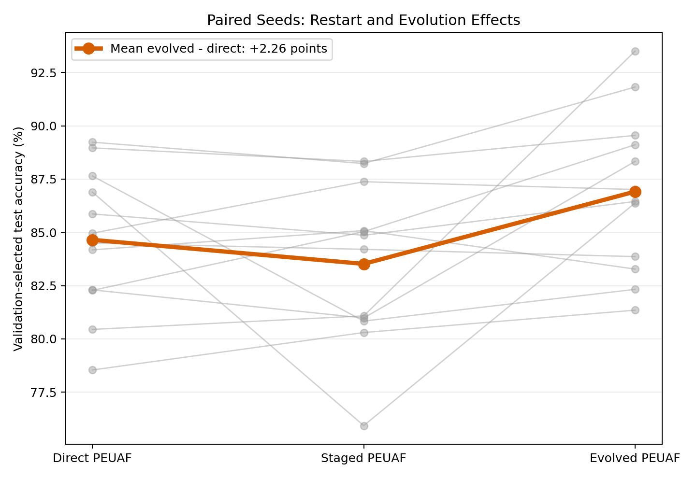
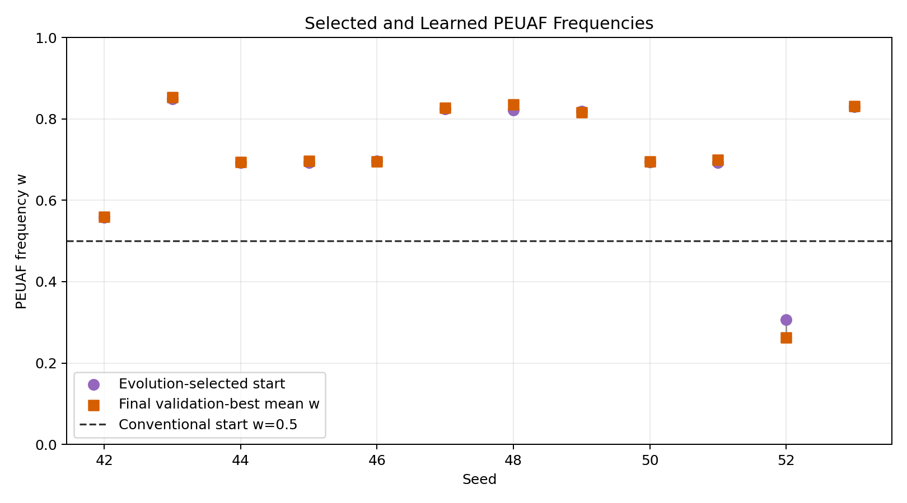
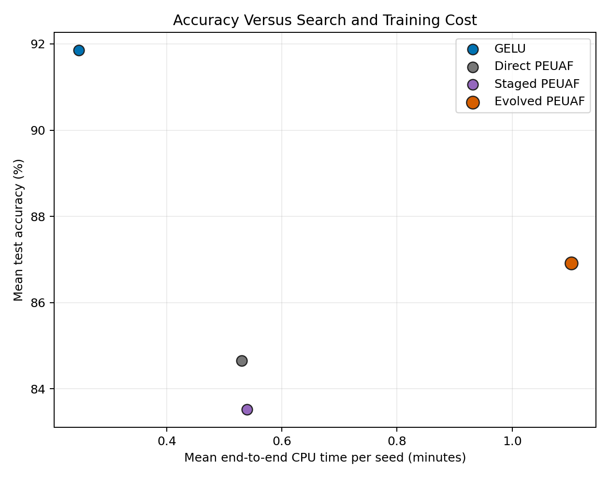
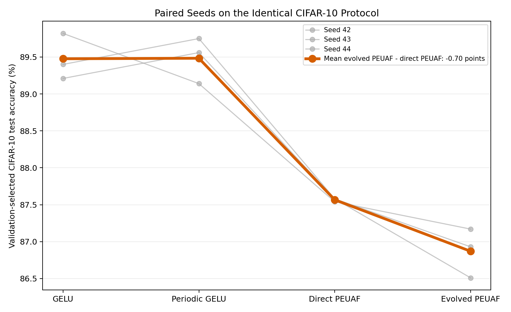
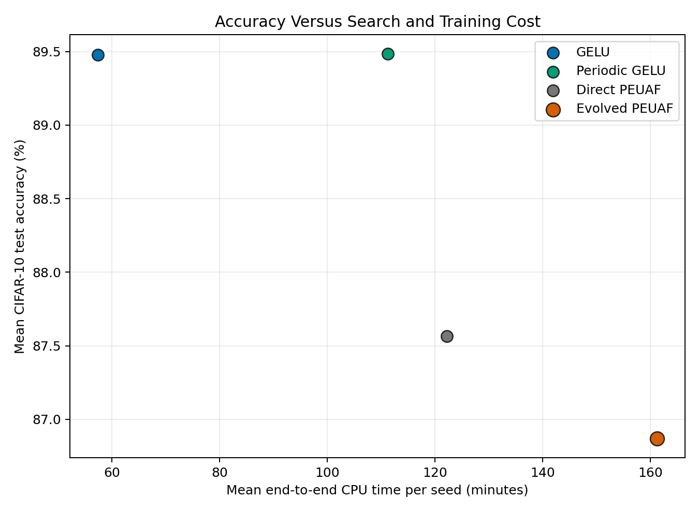
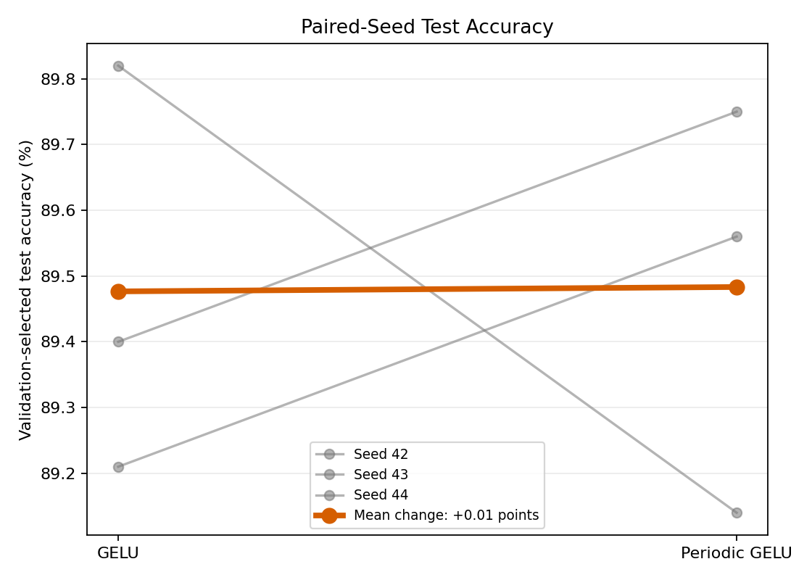
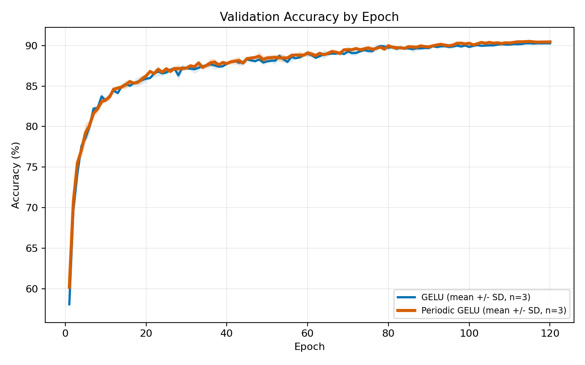
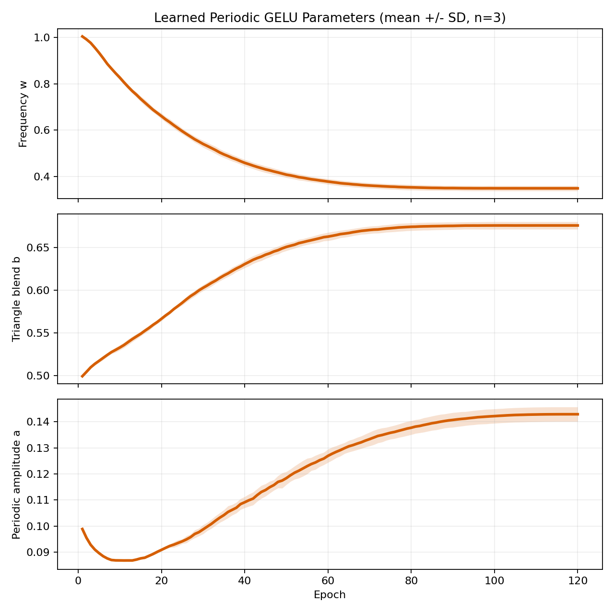
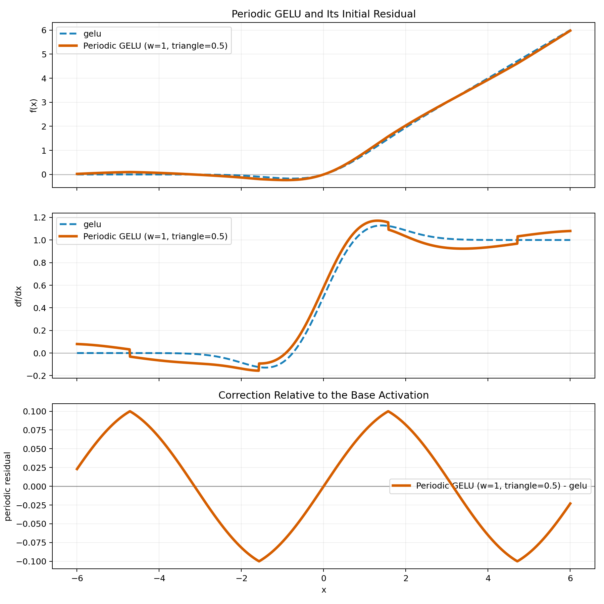

# Periodic Activation Benchmark

This repository is a reproducible PyTorch lab for training, plotting, and comparing activation
functions on MNIST, CIFAR-10/100, and noisy 1D power-quality signals.

I found GPT-5.5 to be an incredibly useful research assistant in studying periodic activation functions such as PEUAF and GELU combined with a sine wave


Four results are worth mentioning:



1. PEUAF frequency optimization is highly multimodal. A frequency-only
   evolutionary warm-up followed by ordinary backpropagation improved PEUAF
   by `+3.39` test points over a restart-matched control in a 12-seed signal
   study. It improved PEUAF, but did not catch GELU.
2. That evolutionary benefit did not transfer to full CIFAR-10. Direct PEUAF
   reached `87.57%`; evolved PEUAF reached `86.87%`; GELU reached `89.48%`.
   Short-run frequency selection was reproducible but predicted the wrong
   long-run winner.
3. On real raw-waveform speech, evolution rescued PEUAF by `+15.63` points
   over direct training, but evolved PEUAF still trailed GELU by `6.06`
   points. Periodic GELU and GELU were tied.
4. A GELU plus learnable periodic residual looked promising in small pilots,
   but a full CIFAR-10 confirmation study found no test-accuracy advantage.
   It matched GELU while taking about `1.94x` as long on CPU. This negative
   confirmation is the repository's strongest evidence about the variant.


## Next Step
Investigate if periodic data such as audio responds better to the 
studied periodic activation functions than the CIFAR-10 image dataset.
## Research Summary

### PEUAF Evolution Confirmation (Synthetic PQD, Not CIFAR-10)

Run on June 14, 2026: 12 paired seeds on a noisy, low-data synthetic
power-quality-disturbance task. Each final model receives a 100-epoch selected
path. Evolution tests six frequencies for ten epochs across two generations,
then continues the validation-selected candidate for 90 epochs. Candidate
runs never evaluate the test set.

These accuracy values are specific to the eight-class 1D signal task and are
not comparable to the CIFAR-10 accuracies in the next section.

| Condition | Test accuracy | Change vs direct PEUAF | CPU time/seed |
| --- | ---: | ---: | ---: |
| GELU | 91.85 +/- 3.37% | +7.20 | 0.25 min |
| Direct PEUAF, `w=0.5` | 84.65 +/- 3.18% | baseline | 0.53 min |
| Staged PEUAF, `10 + 90` epochs | 83.52 +/- 3.59% | -1.13 | 0.54 min |
| Evolved PEUAF | 86.91 +/- 3.61% | +2.26 | 1.10 min |

Evolution beat the restart-matched staged control by `+3.39` points in 9 of
12 seeds. Its paired 95% interval was `[+0.55, +6.23]`. Against uninterrupted
PEUAF it won 8 of 12 seeds, but the `+2.26` point interval
`[-0.71, +5.24]` still crossed zero. Evolved PEUAF remained `4.94` points
behind GELU and required `2.08x` the end-to-end CPU time of direct PEUAF.



The selected frequency explains the effect better than optimizer restarts.
Direct PEUAF finished near mean `w=0.485`. Evolution selected starts averaging
`w=0.706`, and final backpropagation changed them by only `-0.001` on average.
Gradient descent therefore mostly refined the basin chosen by the population
search instead of discovering another frequency basin.



The accuracy gain has a measurable search cost:



See [docs/PEUAF_EVOLUTION_CONFIRMATION.md](docs/PEUAF_EVOLUTION_CONFIRMATION.md)
for the complete protocol and
[docs/results/peuaf_evolution_confirmation](docs/results/peuaf_evolution_confirmation)
for the aggregate, per-seed, candidate, and paired CSV files.

### PEUAF on the Same Full CIFAR-10 Protocol

Run on June 14-15, 2026 using the exact CIFAR-10 split, standard CNN,
optimizer, augmentation, 120-epoch schedule, and seeds from the Periodic GELU
study. The GELU and Periodic GELU rows below are the original reference runs,
not a different experiment.

| Condition | Test accuracy | Change vs GELU | CPU time/seed |
| --- | ---: | ---: | ---: |
| GELU | 89.477 +/- 0.255% | baseline | 57.42 min |
| Periodic GELU | 89.483 +/- 0.255% | +0.007 | 111.20 min |
| Direct PEUAF, `w=0.5` | 87.567 +/- 0.019% | -1.910 | 122.22 min |
| Evolved PEUAF | 86.870 +/- 0.273% | -2.607 | 161.21 min |

Direct PEUAF trailed GELU in all three pairs. Its paired 95% interval was
`[-2.74, -1.08]` points. Evolution selected the highest initial grid
frequency, `w=0.77`, for every seed, but evolved PEUAF finished below direct
PEUAF in all three pairs. The evolved-minus-direct mean was `-0.70` points
with interval `[-1.57, +0.18]`.



The search accurately identified the strongest five-epoch frequency, but its
early ranking did not survive long training. Evolved PEUAF also used 155
total epoch-equivalents per seed and took `1.32x` as long as direct PEUAF.



The complete protocol, limitations, frequency plots, and learning curves are
in [docs/PEUAF_CIFAR10_CONFIRMATION.md](docs/PEUAF_CIFAR10_CONFIRMATION.md).
Machine-readable results are in
[docs/results/peuaf_cifar10_full_120epoch](docs/results/peuaf_cifar10_full_120epoch).

### Periodic GELU Full CIFAR-10 Confirmation

Run on June 14, 2026: full 45,000-image training split, 5,000 validation
images, 10,000 test images, 120 epochs, cosine learning-rate decay, and three
paired seeds. All test values use validation-selected weights.

| Metric | GELU | Periodic GELU | Change |
| --- | ---: | ---: | ---: |
| Best validation accuracy | 90.340 +/- 0.185% | 90.553 +/- 0.096% | +0.213 |
| Test accuracy | 89.477 +/- 0.255% | 89.483 +/- 0.255% | +0.007 |
| Final-model test accuracy | 89.503 +/- 0.243% | 89.587 +/- 0.082% | +0.083 |
| CPU training time per run | 57.42 +/- 0.14 min | 111.20 +/- 0.09 min | 1.94x |

The periodic variant won two test pairs and lost one. Its paired mean test
change was only `+0.007` percentage points, with a wide 95% confidence
interval of approximately `[-1.47, +1.48]` because `n=3`. The defensible
conclusion is a tie, not a win. The earlier small-data gain did not persist
after scaling the data and training duration.

Using the observed paired variability, a rough 80%-power calculation suggests
about 12 paired seeds to detect a `0.50`-point effect or 45 to detect a
`0.25`-point effect. These estimates are uncertain because the variance comes
from only three pairs. More runs are needed to resolve a small advantage, but
the current data do not justify claiming one.



The orange candidate is rendered above the blue baseline, and each line below
is the mean across seeds with a one-standard-deviation band.



The periodic parameters did learn rather than remaining at initialization:
mean frequency fell from `1.0` to about `0.35`, triangle blend rose from `0.5`
to about `0.68`, and periodic amplitude rose from `0.1` to about `0.143`.
That adaptation did not translate into a reliable test improvement.



The exact per-run and aggregate values are available in
[docs/results/periodic_gelu_cifar10_full_120epoch](docs/results/periodic_gelu_cifar10_full_120epoch).
See [docs/PERIODIC_GELU_LONG_RUN.md](docs/PERIODIC_GELU_LONG_RUN.md) for the
protocol and interpretation.

### Earlier Diagnostic Pilots

These smaller experiments use paired initialization seeds and
validation-selected weights. The CIFAR-10 pilot used only 8,192 training
examples and should not be treated as a leaderboard result.

| Task | Runs | GELU | GELU + sine-triangle | Change |
| --- | ---: | ---: | ---: | ---: |
| MNIST CNN | 3 | 96.76 +/- 0.22% | 96.83 +/- 0.08% | +0.07 |
| CIFAR-10 CNN | 3 | 69.55 +/- 1.27% | 70.51 +/- 0.62% | +0.96 |
| Noisy low-data PQD signals | 6 | 86.76 +/- 3.88% | 88.26 +/- 4.81% | +1.50 |

The deeper CIFAR ResNet pilot was also inconclusive. GELU reached 56.93% on the
tested seed. The hybrid reached 56.54% with periodic amplitude `0.1` and
57.23% with amplitude `0.01`. Periodic variants were roughly 1.5-2.3 times
slower than GELU in these CPU runs.

An initial attempt to improve PEUAF by blending its triangle component with a
smooth sine wave was disappointing. The more robust variant preserves GELU
and adds the periodic function as a residual:

```text
GELU(x) + a * (b * triangle(w*x) + (1-b) * sin(w*x))
```

`a`, `b`, and `w` are learnable and constrained. The full confirmation above
shows that this flexibility is not enough to outperform GELU on the tested
CIFAR-10 CNN. See
[docs/SINE_TRIANGLE.md](docs/SINE_TRIANGLE.md) for the derivation, numerical
pitfalls, results, and limitations.

The PEUAF work found a different useful result: periodic expressivity creates
a highly multimodal frequency objective. A custom frequency-only population
search followed by backpropagation is more practical than evolving every
network weight. See [docs/PEUAF.md](docs/PEUAF.md).

## Features

- YAML-configured train, validation, test, and parameter sweeps
- MNIST, CIFAR-10, CIFAR-100, compact/deep CNNs, ResNet-18, and 1D signal CNN
- Augmentation, deterministic subsets, paired seeds, and best-validation tests
- TensorBoard, CSV/JSON histories, and benchmark PNGs
- Step-numbered checkpoints with configurable latest-N retention
- Checkpoint resume, warm starts, and standalone evaluation
- Activation value/derivative plots with CSV and metadata export
- PEUAF grid, multi-start, PyGAD/TorchGA, evolution, and successive halving
- Configurable PyTorch thread counts and Windows process affinity
- Double-clickable Windows launchers and matching Linux Bash scripts

## Setup

Python 3.10 or newer:

Windows PowerShell:

```powershell
python -m venv .venv
.\.venv\Scripts\Activate.ps1
python -m pip install -r requirements.txt
```

Linux:

```bash
python3 -m venv .venv
source .venv/bin/activate
python -m pip install -r requirements.txt
```

Development and optional evolutionary dependencies:

```text
python -m pip install -r requirements-dev.txt
```

## Download Datasets

Training configs can download image datasets automatically because
`data.download` defaults to `true`. To prepare every dataset before training,
use the explicit downloader:

Windows:

```powershell
download_datasets.bat
```

Linux:

```bash
bash download_datasets.sh
```

The downloader uses TorchVision's official download, integrity-check, and
archive-extraction implementation. It prepares both train and test splits:

```text
data/MNIST/                 MNIST raw and processed files
data/cifar-10-batches-py/   extracted CIFAR-10 files
data/cifar-100-python/      extracted CIFAR-100 files
```

Download only selected datasets or use another root:

```text
python -m activation_benchmark.download_datasets \
  --datasets mnist cifar10 --root data
```

Accepted names are `mnist`, `cifar10`, `cifar100`, and `all`. Downloads are
idempotent: existing verified files are reused. The synthetic PQD dataset is
generated locally at runtime and has nothing to download. For offline
training after preparation, set `data.download: false` in the YAML config or
pass `--set data.download=false`.

## Quick Start

Double-click `train.bat`, run `bash train.sh` on Linux, or invoke Python
directly:

```powershell
python -m activation_benchmark.train --config configs/mnist.yaml
```

Run a smoke test:

```powershell
python -m activation_benchmark.train --config configs/smoke.yaml
python -m pytest
```

Override any YAML value:

```powershell
python -m activation_benchmark.train --config configs/cifar10.yaml `
  --set model.activation=gelu_sine_triangle training.epochs=20
```

Run a generic benchmark:

```powershell
python -m activation_benchmark.benchmark `
  --config configs/benchmark_activations.yaml
```

Research comparisons:

```powershell
python -m activation_benchmark.benchmark `
  --config configs/benchmark_sine_triangle_mnist.yaml
python -m activation_benchmark.benchmark `
  --config configs/benchmark_sine_triangle_cifar10.yaml
python -m activation_benchmark.benchmark `
  --config configs/benchmark_sine_triangle_pqd.yaml
```

Run the reproducible full CIFAR-10 confirmation:

```powershell
benchmark_periodic_gelu_long.bat
```

On Linux:

```bash
bash benchmark_periodic_gelu_long.sh
```

Run PEUAF and evolutionary frequency search on the same full protocol:

```powershell
benchmark_peuaf_cifar10.bat
```

On Linux:

```bash
bash benchmark_peuaf_cifar10.sh
```

The ResNet config uses the depth-safer `gelu_sine_triangle_deep` variant,
whose periodic amplitude starts at `0.01`:

```powershell
python -m activation_benchmark.benchmark `
  --config configs/benchmark_sine_triangle_resnet18.yaml
```

## Activation Plots

Double-click `plot_activations.bat`, or:

```powershell
python -m activation_benchmark.plot_activations `
  --activations peuaf sine_triangle gelu gelu_sine_triangle `
  --w 0.5 1.0 --blend 0.25 0.5 0.75
```

Outputs include `activation_shapes.png`, sampled values and derivatives in
CSV, and JSON metadata. Periodic residual activations are drawn last with a
heavier line, and a separate residual panel exposes small corrections that
would otherwise be hidden behind the base activation.



## PEUAF Optimization

Run the one-parameter basin study:

```powershell
python -m activation_benchmark.frequency_optimization `
  --config configs/benchmark_peuaf_frequency_optimization.yaml
```

Run frequency-only evolution or successive halving before final
backpropagation:

```powershell
python -m activation_benchmark.multistart `
  --config configs/peuaf_evolutionary_multistart.yaml
python -m activation_benchmark.multistart `
  --config configs/peuaf_signal_successive_halving.yaml
```

Run the 12-seed PEUAF evolution confirmation:

```powershell
benchmark_peuaf_evolution.bat
```

On Linux:

```bash
bash benchmark_peuaf_evolution.sh
```

For one scalar frequency, a grid is simpler and more reliable than a genetic
algorithm. The evolutionary workflow becomes more relevant when several
activation frequencies must be searched jointly.

## Checkpoints And TensorBoard

Checkpoints are named `step_00000123.pt`. `checkpoint.keep_latest` controls
retention and defaults to three. Each checkpoint also stores the
validation-best model weights.

Resume an existing run:

```powershell
python -m activation_benchmark.train --config configs/mnist.yaml `
  --set experiment.name=my_run checkpoint.resume=latest
```

Launch TensorBoard with `tensorboard.bat`, or:

```powershell
python -m tensorboard.main --logdir runs --port 6006
```

On Linux, use `bash tensorboard.sh`.

## Platform Launchers

Windows `.bat` and Linux `.sh` launchers provide the same commands:

| Purpose | Windows | Linux |
| --- | --- | --- |
| Download datasets | `download_datasets.bat` | `bash download_datasets.sh` |
| Train MNIST | `train.bat` | `bash train.sh` |
| Train CIFAR-10 | `train_cifar10.bat` | `bash train_cifar10.sh` |
| Train CIFAR ResNet-18 | `train_cifar10_resnet18.bat` | `bash train_cifar10_resnet18.sh` |
| Train synthetic PQD | `train_synthetic_pqd.bat` | `bash train_synthetic_pqd.sh` |
| PEUAF multi-start | `train_peuaf_multistart.bat` | `bash train_peuaf_multistart.sh` |
| PEUAF evolution study | `benchmark_peuaf_evolution.bat` | `bash benchmark_peuaf_evolution.sh` |
| Full CIFAR-10 PEUAF study | `benchmark_peuaf_cifar10.bat` | `bash benchmark_peuaf_cifar10.sh` |
| Generic benchmark | `benchmark.bat` | `bash benchmark.sh` |
| CIFAR-10 benchmark | `benchmark_cifar10.bat` | `bash benchmark_cifar10.sh` |
| Sine-triangle benchmark | `benchmark_sine_triangle.bat` | `bash benchmark_sine_triangle.sh` |
| Full periodic GELU study | `benchmark_periodic_gelu_long.bat` | `bash benchmark_periodic_gelu_long.sh` |
| Plot activations | `plot_activations.bat` | `bash plot_activations.sh` |
| TensorBoard | `tensorboard.bat` | `bash tensorboard.sh` |

Arguments are forwarded to the Python command. The Bash scripts use
`.venv/bin/python` when available, otherwise `python3`. Override that choice
with, for example, `PYTHON=python3.12 bash train.sh`.

The checked-in research configs contain CPU affinity tuned for the original
Windows workstation. Bash training and benchmark launchers disable that
machine-specific affinity by default so they work on Linux systems with
different CPU counts. Set
`ACTIVATION_BENCHMARK_DISABLE_AFFINITY=0 bash train_cifar10.sh` to use the
affinity from the YAML config.

## Project Layout

```text
activation_benchmark/  training, models, activations, plots, and research tools
configs/               reusable training and benchmark protocols
docs/                  concise research reports
tests/                 unit and smoke coverage
runs/                  generated outputs, ignored by Git
data/                  downloaded datasets, ignored by Git
```

## References

- [EUAF and PEUAF paper](https://arxiv.org/abs/2407.09580)
- [SIREN](https://arxiv.org/abs/2006.09661)
- [Adaptive Blending Units](https://arxiv.org/abs/1806.10064)
- [ACON learnable activations](https://arxiv.org/abs/2009.04759)
- [BigVGAN periodic activations](https://arxiv.org/abs/2206.04658)
- [Periodic activations and extrapolation](https://arxiv.org/abs/2209.10280)

## License

MIT
