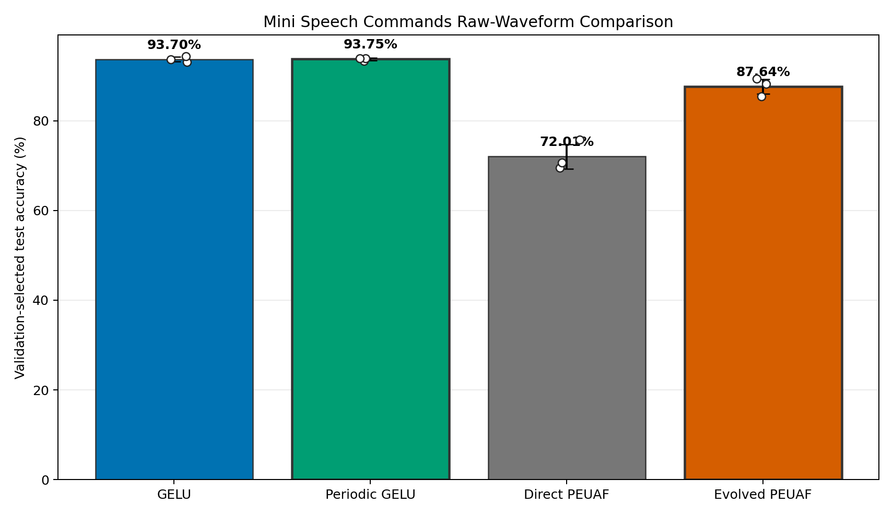
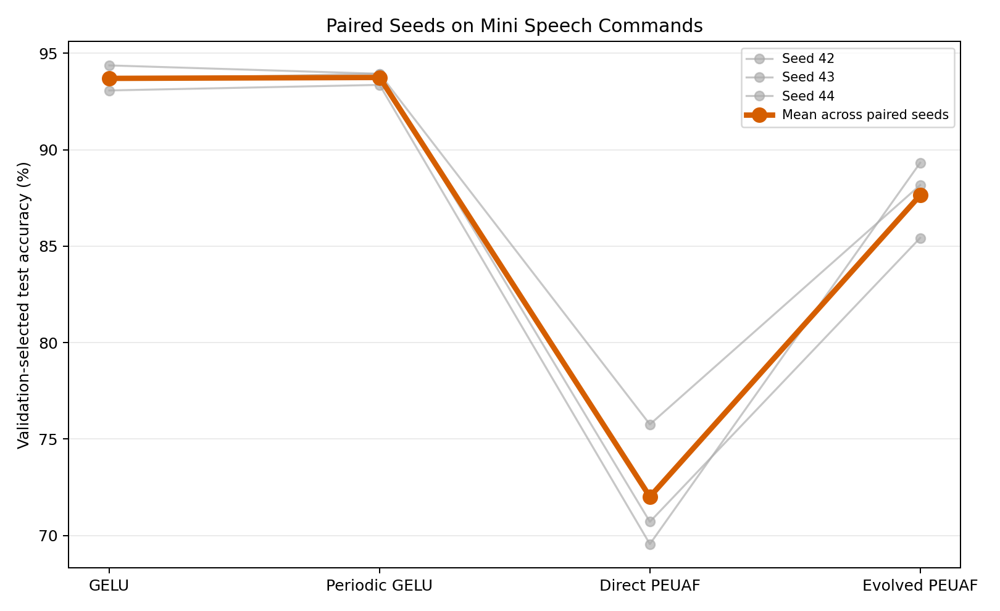
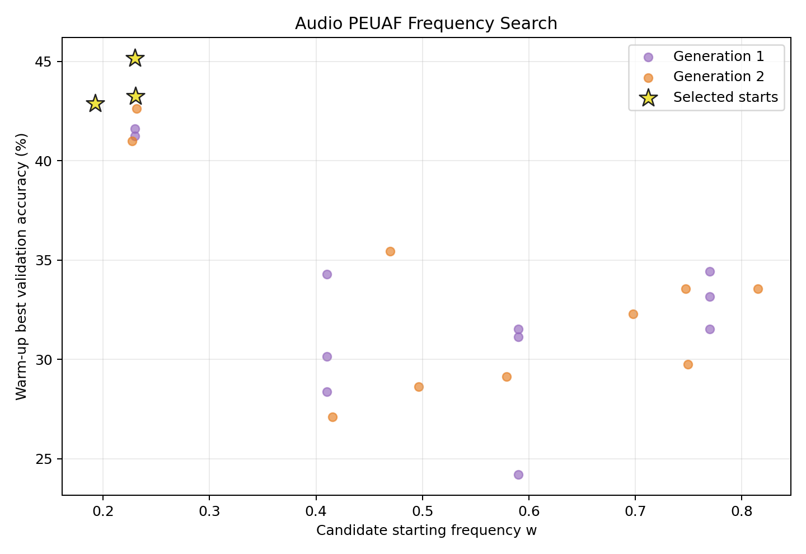
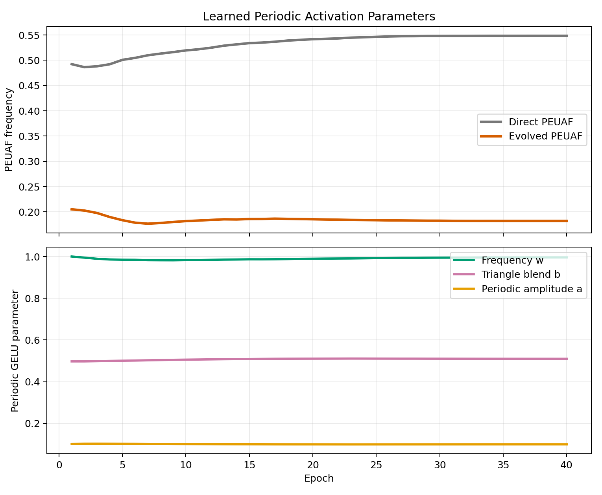
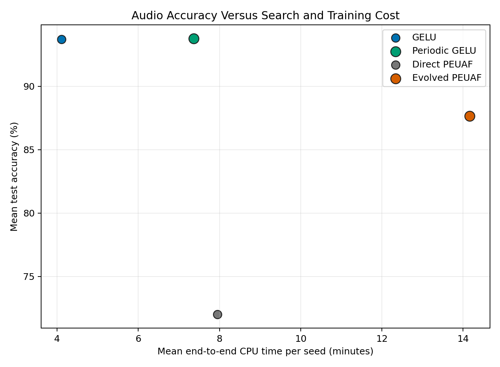

# Raw-Waveform Audio Activation Study

## Question

Do PEUAF or Periodic GELU benefit from the periodic structure in real audio
when compared with GELU under the same paired-seed protocol?

The benchmark uses
[Mini Speech Commands](https://www.tensorflow.org/tutorials/audio/simple_audio),
TensorFlow's official 8,000-clip subset of the
[Speech Commands dataset](https://arxiv.org/abs/1804.03209). It contains eight
spoken words: `down`, `go`, `left`, `no`, `right`, `stop`, `up`, and `yes`.

## Protocol

- Date: June 15, 2026
- Input: raw mono PCM waveform, padded to 16,000 samples at 16 kHz
- Split: speaker-disjoint deterministic hash split
- Samples: 6,514 train, 793 validation, 693 test
- Architecture: five-layer strided 1D CNN, approximately 192,000 parameters
- Epochs: 40 for every final model
- Optimizer: AdamW, learning rate `0.001`, weight decay `0.0001`
- Schedule: cosine decay to zero
- Augmentation: time shift, gain, additive noise, and peak normalization
- Seeds: 42, 43, and 44, paired across all conditions
- Selection: best validation checkpoint evaluated once on the test set
- Hardware: CPU-only i9-12900K class system, eight P cores with SMT

The raw-waveform representation was chosen so that activation functions see
oscillatory signals directly rather than only a log-mel image.

Four conditions were compared:

1. GELU.
2. Periodic GELU:
   `GELU(x) + a[bT(wx) + (1-b)sin(wx)]`.
3. Direct PEUAF initialized at `w=0.5`.
4. Evolved PEUAF. Four starts are evaluated for four epochs over two
   generations. The selected starting frequency is then trained from scratch
   for the same full 40-epoch schedule as every other final model.

Search candidates use validation accuracy and never evaluate the test set.
Retraining from scratch removes the warm-start and scheduler-reset confound
present in the earlier CIFAR-10 evolutionary workflow.

## Results

| Condition | Test accuracy | Best validation | CPU time/seed |
| --- | ---: | ---: | ---: |
| GELU | 93.699 +/- 0.531% | 93.947 +/- 0.371% | 4.11 min |
| Periodic GELU | 93.747 +/- 0.272% | 94.283 +/- 0.119% | 7.36 min |
| Direct PEUAF | 72.006 +/- 2.694% | 72.047 +/- 2.556% | 7.95 min |
| Evolved PEUAF | 87.638 +/- 1.634% | 87.852 +/- 1.518% | 14.16 min |

Per-seed validation-selected test accuracy:

| Seed | GELU | Periodic GELU | Direct PEUAF | Evolved PEUAF |
| ---: | ---: | ---: | ---: | ---: |
| 42 | 93.07% | 93.36% | 69.55% | 89.32% |
| 43 | 93.65% | 93.94% | 70.71% | 85.43% |
| 44 | 94.37% | 93.94% | 75.76% | 88.17% |
| Mean | 93.699% | 93.747% | 72.006% | 87.638% |

Paired comparisons use a two-sided Student t interval with two degrees of
freedom:

| Comparison | Mean change | 95% interval | Wins |
| --- | ---: | ---: | ---: |
| Periodic GELU - GELU | +0.048 | `[-0.987, +1.083]` | 2/3 |
| Direct PEUAF - GELU | -21.693 | `[-28.355, -15.032]` | 0/3 |
| Evolved PEUAF - direct PEUAF | +15.632 | `[+6.283, +24.982]` | 3/3 |
| Evolved PEUAF - GELU | -6.061 | `[-11.625, -0.496]` | 0/3 |

Periodic GELU and GELU are statistically unresolved and practically tied.
The study therefore does not show an audio-classification advantage for the
periodic residual. Evolved PEUAF is substantially better than direct PEUAF,
but remains below GELU in every seed.

## Optimization Finding

Evolution selected low starting frequencies consistently:

| Frequency statistic | Mean +/- population SD |
| --- | ---: |
| Selected start | `0.218 +/- 0.018` |
| After four-epoch candidate training | `0.192 +/- 0.049` |
| Final validation-best model | `0.182 +/- 0.060` |
| Direct PEUAF final model | `0.548 +/- 0.009` |

The short search cleanly identified a different basin. Training that
initialization from scratch recovered `+15.63` test points, demonstrating
that PEUAF's starting-frequency problem transfers from synthetic periodic
signals to real speech. The remaining gap shows that optimization was not its
only disadvantage.

Periodic GELU's parameters barely moved: at the validation-best checkpoints,
mean frequency was `0.995`, triangle blend `0.510`, and periodic amplitude
`0.099`. The model retained the small initialized residual rather than
discovering an obviously audio-specific periodic correction.

## Cost And Interpretation

Periodic GELU took `1.79x` GELU's CPU time. Direct PEUAF took `1.93x`.
Evolution evaluated 32 search epoch-equivalents and then trained a fresh
40-epoch winner, taking `3.44x` GELU and `1.78x` direct PEUAF wall time.

This result narrows the hypothesis. The mere presence of periodic waveforms
does not guarantee that a periodic hidden activation improves
classification. A convolutional frontend can learn frequency-selective
filters while GELU remains an effective latent nonlinearity. Periodic
activations may be better motivated for waveform synthesis, implicit audio
representations, pitch regression, or other tasks where phase and periodic
coordinate structure must be represented directly.

The three-seed sample is sufficient to establish the large evolutionary
rescue, but not to distinguish a sub-point Periodic GELU effect from zero.

## Artifacts

- [Aggregate CSV](results/audio_mini_speech_commands/aggregate.csv)
- [Per-seed CSV](results/audio_mini_speech_commands/runs.csv)
- [Candidate CSV](results/audio_mini_speech_commands/candidates.csv)
- [Paired differences](results/audio_mini_speech_commands/paired_differences.csv)
- Base config: `configs/audio_mini_speech_commands.yaml`
- Benchmark config: `configs/benchmark_audio_activations.yaml`
- Windows launcher: `benchmark_audio.bat`
- Linux launcher: `benchmark_audio.sh`
