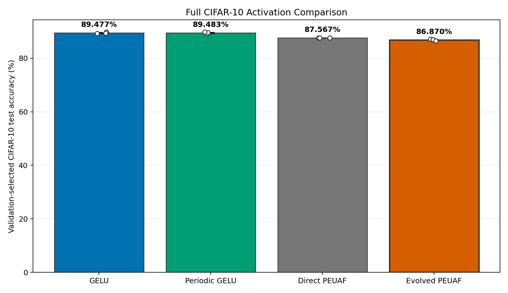
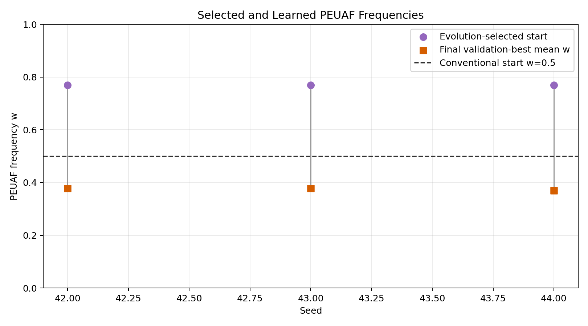
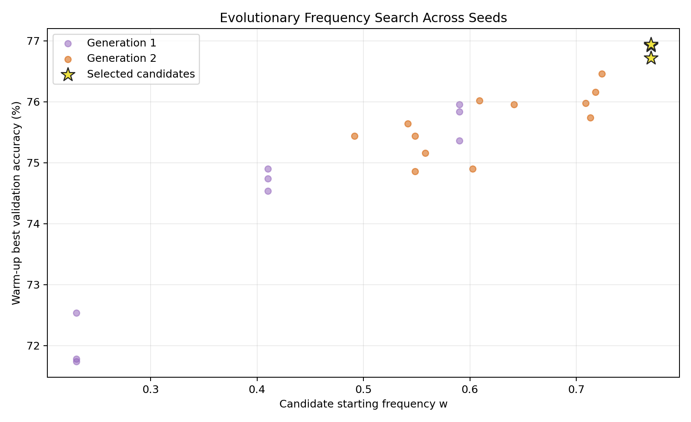
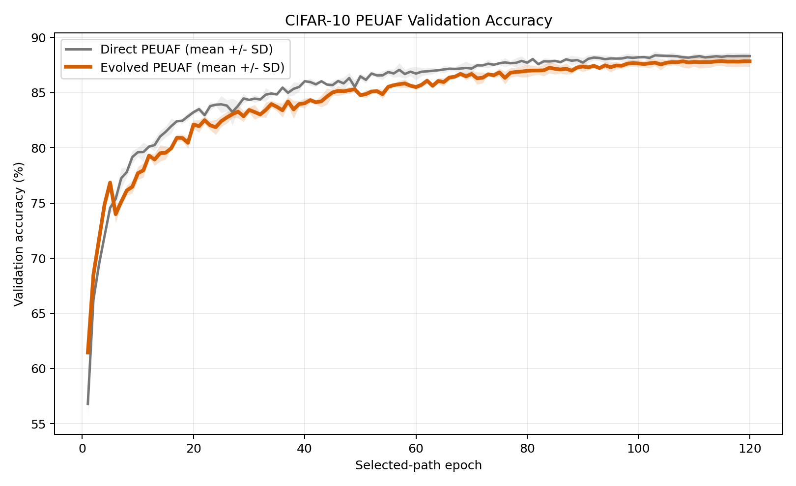

# Full CIFAR-10 PEUAF Study

## Question

Does PEUAF, with or without an evolutionary search for its starting
frequency, outperform GELU on the same full CIFAR-10 protocol used for the
Periodic GELU study?

This is the directly comparable CIFAR-10 experiment. The earlier `91.85%`
GELU result came from the synthetic eight-class 1D power-quality-disturbance
task and should not be compared with these values.

## Protocol

- Date: June 14-15, 2026
- Dataset: CIFAR-10
- Split: 45,000 train, 5,000 validation, 10,000 test
- Architecture: project standard CNN, approximately 550,000 parameters
- Epochs: 120 on each selected final path
- Optimizer: AdamW, learning rate `0.001`, weight decay `0.0001`
- Schedule: cosine decay to zero
- Augmentation: random crop, horizontal flip, random erasing
- Seeds: 42, 43, and 44, paired across all conditions
- Selection: best validation checkpoint evaluated once on the test set
- Hardware: CPU-only i9-12900K class system, eight P cores with SMT

The GELU and Periodic GELU rows are the exact runs from the previous full
CIFAR-10 study. They were loaded from its published per-run CSV rather than
retrained.

Direct PEUAF starts from `w=0.5` and trains continuously for 120 epochs.
Evolved PEUAF evaluates four frequencies for five epochs over two
generations. Candidate selection uses validation accuracy and never evaluates
the test set. The selected candidate is then continued for 115 epochs, giving
it a 120-epoch selected path.

## Results

| Condition | Test accuracy | Best validation | CPU time/seed |
| --- | ---: | ---: | ---: |
| GELU | 89.477 +/- 0.255% | 90.340 +/- 0.185% | 57.42 min |
| Periodic GELU | 89.483 +/- 0.255% | 90.553 +/- 0.096% | 111.20 min |
| Direct PEUAF | 87.567 +/- 0.019% | 88.487 +/- 0.246% | 122.22 min |
| Evolved PEUAF | 86.870 +/- 0.273% | 87.980 +/- 0.396% | 161.21 min |

Per-seed validation-selected test accuracy:

| Seed | GELU | Periodic GELU | Direct PEUAF | Evolved PEUAF |
| ---: | ---: | ---: | ---: | ---: |
| 42 | 89.82% | 89.14% | 87.54% | 87.17% |
| 43 | 89.21% | 89.56% | 87.58% | 86.93% |
| 44 | 89.40% | 89.75% | 87.58% | 86.51% |
| Mean | 89.477% | 89.483% | 87.567% | 86.870% |

Paired comparisons use a two-sided Student t interval with two degrees of
freedom:

| Comparison | Mean change | 95% interval | Wins |
| --- | ---: | ---: | ---: |
| Direct PEUAF - GELU | -1.910 | `[-2.740, -1.080]` | 0/3 |
| Evolved PEUAF - GELU | -2.607 | `[-3.370, -1.843]` | 0/3 |
| Evolved PEUAF - direct PEUAF | -0.697 | `[-1.572, +0.179]` | 0/3 |
| Periodic GELU - GELU | +0.007 | `[-1.471, +1.484]` | 2/3 |

The three-seed sample is small, but the PEUAF gap is consistent and large
enough that both PEUAF conditions have intervals wholly below GELU. The
evolution-versus-direct interval still crosses zero, so the experiment does
not establish the exact size of evolution's harm.

## Evolution Behavior

All three searches selected the highest initial grid candidate, `w=0.77`.
After its five-epoch warm-up, the selected candidate's mean learned frequency
was approximately `0.713`. During long continuation training it fell to
approximately `0.375`. Direct PEUAF ended near mean `w=0.329`.

The short-run validation ranking was reproducible: higher starting
frequencies performed better after five epochs in every seed.

That ranking did not predict the best 120-epoch result. Direct PEUAF remained
ahead for most of training and won every test pair.

## Cost And Limitations

Evolution consumed 40 candidate epoch-equivalents plus the selected
candidate's 115-epoch continuation, or 155 total epoch-equivalents per seed.
Its observed wall time was `1.32x` direct PEUAF, `1.45x` Periodic GELU, and
`2.81x` GELU.

The evolved workflow includes a learning-rate restart after the five-epoch
candidate stage, while direct PEUAF uses one uninterrupted 120-epoch cosine
schedule. There is no restart-matched CIFAR-10 control in this experiment.
Consequently, the evolved-versus-direct comparison measures the complete
search workflow, not frequency selection in isolation. The earlier synthetic
study includes that control and found that a restart alone did not explain
its positive result.

The practical conclusion is that frequency evolution is task-dependent. It
helped PEUAF on the low-data periodic signal task, but it did not transfer to
this conventional image-classification problem. On this CIFAR-10 CNN, GELU is
both more accurate and substantially faster.

## Artifacts

- [Aggregate CSV](results/peuaf_cifar10_full_120epoch/aggregate.csv)
- [Per-seed CSV](results/peuaf_cifar10_full_120epoch/runs.csv)
- [Candidate CSV](results/peuaf_cifar10_full_120epoch/candidates.csv)
- [Paired differences](results/peuaf_cifar10_full_120epoch/paired_differences.csv)
- Reproduction config: `configs/benchmark_peuaf_cifar10_confirmation.yaml`
- Windows launcher: `benchmark_peuaf_cifar10.bat`
- Linux launcher: `benchmark_peuaf_cifar10.sh`
