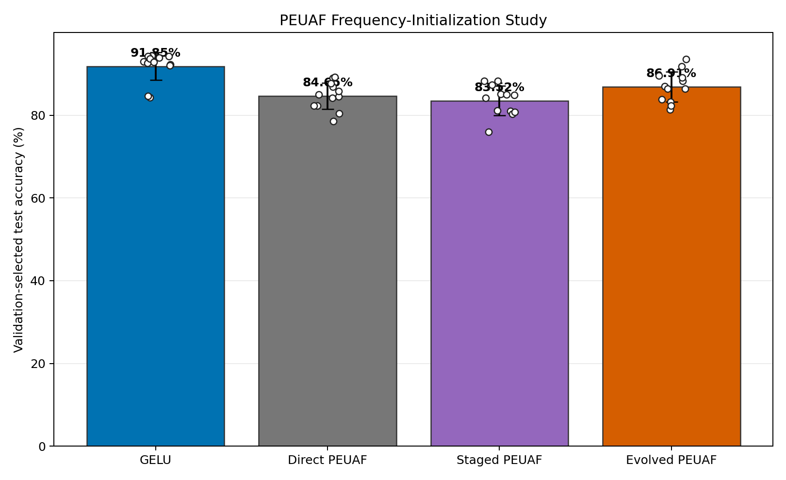
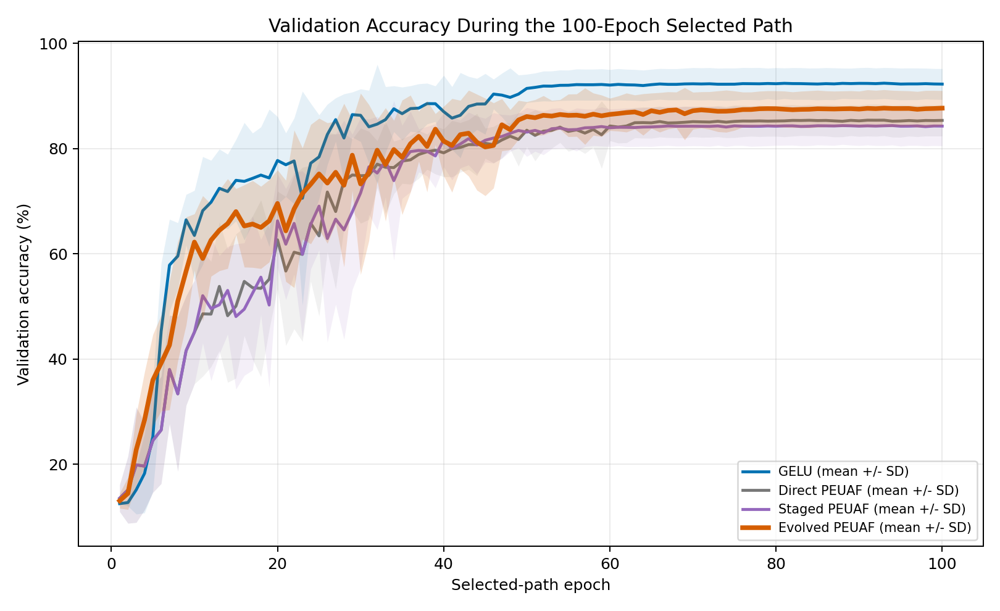
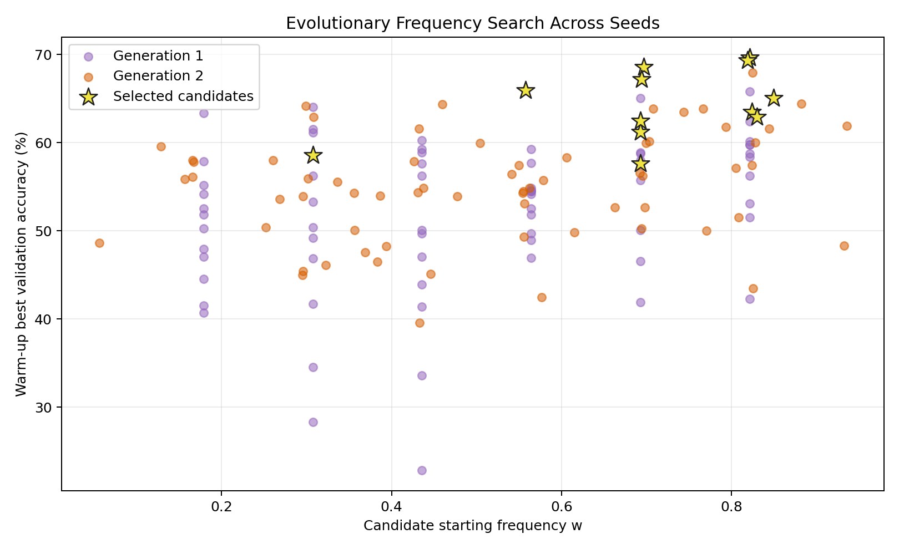

# PEUAF Evolution Confirmation

> **Dataset:** This report is for the synthetic eight-class 1D
> power-quality-disturbance task. It is not a CIFAR-10 experiment, so its
> accuracy values must not be compared numerically with the CIFAR-10 results.

## Question

Does population-based frequency initialization improve PEUAF because it finds
a better frequency basin, or does the apparent benefit come from warm
restarts and validation-best checkpointing?

## Protocol

- Date: June 14, 2026
- Task: synthetic eight-class power-quality-disturbance signals
- Data: 256 train, 1,024 validation, 4,096 test
- Signal length: 256
- Noise standard deviation: `0.20`
- Architecture: compact six-convolution 1D signal CNN
- Seeds: 42 through 53
- Optimizer: NAdam with validation-plateau learning-rate decay
- Selected path: 100 epochs for every final condition
- Selection: validation accuracy only
- Test policy: candidate and warm-up stages never evaluate test data

Four paired conditions were run for every seed:

1. **GELU:** uninterrupted 100-epoch reference.
2. **Direct PEUAF:** uninterrupted 100 epochs from `w=0.5`.
3. **Staged PEUAF:** ten epochs from `w=0.5`, then a validation-best warm
   restart for 90 epochs.
4. **Evolved PEUAF:** six candidates, two generations, and ten warm-up epochs
   per candidate. The validation-best candidate then continues for 90 epochs.

Generation one uses a frequency grid within `[0.05, 0.95]`. Generation two
retains two elites and fills the population using averaged parent frequencies
plus Gaussian mutation. Only PEUAF frequencies are searched; convolution and
classifier weights use ordinary backpropagation.

## Results

| Condition | Test accuracy | Best validation | End-to-end CPU time |
| --- | ---: | ---: | ---: |
| GELU | 91.850 +/- 3.370% | 92.676 +/- 2.782% | 14.82 +/- 0.57 s |
| Direct PEUAF | 84.650 +/- 3.184% | 85.726 +/- 2.942% | 31.81 +/- 0.83 s |
| Staged PEUAF | 83.521 +/- 3.592% | 84.757 +/- 3.704% | 32.39 +/- 1.43 s |
| Evolved PEUAF | 86.914 +/- 3.611% | 88.029 +/- 3.367% | 66.16 +/- 1.58 s |

Paired comparisons:

| Comparison | Mean change | 95% interval | Wins |
| --- | ---: | ---: | ---: |
| Evolved - staged PEUAF | +3.394 | `[+0.554, +6.233]` | 9/12 |
| Evolved - direct PEUAF | +2.264 | `[-0.712, +5.241]` | 8/12 |
| Evolved - GELU | -4.936 | `[-8.192, -1.679]` | 1/12 |
| Staged - direct PEUAF | -1.129 | `[-3.651, +1.392]` | 5/12 |

The staged control did not improve direct PEUAF. Evolution's advantage over
that control therefore cannot be explained by the optimizer restart alone.
The gain over uninterrupted PEUAF is promising but not statistically resolved
at 12 seeds.

The selected-path learning curves show that evolved PEUAF separates from the
two ordinary PEUAF conditions before convergence rather than only benefiting
from a lucky final checkpoint.

## Frequency Behavior

Evolution selected starting frequencies with mean `0.706 +/- 0.147`. Eleven
of twelve selected starts were above the conventional `w=0.5`. Their final
validation-best mean was `0.706 +/- 0.158`; backpropagation changed the
selected frequency by only `-0.001` on average.

By comparison, direct PEUAF finished at mean `w=0.485 +/- 0.011`. This supports
the optimization-basin interpretation: gradient descent adjusts frequencies
locally, while population search determines which broad basin is trained.

Seven winners came from generation two and five from the initial grid.

## Cost And Interpretation

Evolution used 120 candidate warm-up epoch-equivalents plus the winner's
90-epoch continuation. Its mean wall time was `2.08x` direct PEUAF and `4.46x`
GELU on this CPU task.

The practical conclusion is narrow but useful:

- Frequency search materially improves PEUAF relative to the same staged
  training schedule without search.
- More seeds are needed to establish the improvement over uninterrupted
  PEUAF with high confidence.
- The searched PEUAF still underperforms GELU here, so evolution addresses an
  optimization weakness rather than making PEUAF the best activation.
- The method is most attractive when unusual periodic expressivity is needed
  and candidate warm-ups can be parallelized.

## Artifacts

- [Aggregate CSV](results/peuaf_evolution_confirmation/aggregate.csv)
- [Per-seed CSV](results/peuaf_evolution_confirmation/runs.csv)
- [Candidate CSV](results/peuaf_evolution_confirmation/candidates.csv)
- [Paired differences](results/peuaf_evolution_confirmation/paired_differences.csv)
- Reproduction config: `configs/benchmark_peuaf_evolution_confirmation.yaml`
